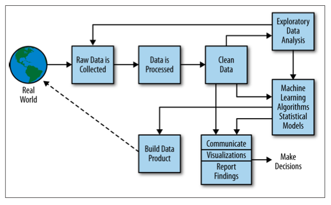

```{r setup, include=TRUE}
knitr::opts_chunk$set(echo = TRUE)

if(system("hostname", intern=TRUE) == "gben3001.hpc.wvu.edu"){
  hdfs.path <- "/user/eharner";
  spark.master <- "yarn-client"
  } else {
    hdfs.path <- "/user/rstudio";
    spark.master <- "local"}
```

The setup R chuck launches the [YARN client](https://hadoop.apache.org/docs/r2.7.2/hadoop-yarn/hadoop-yarn-site/YARN.html) on `gofirst`, but also allows me to launch a Dockerized testing environment. You need to change the `hdfs.path` to `"/user/youruserlogin"` in order to run this code. 

## Overview

This module introduces the principal technologies that will be used in BUDA 515. These include the Linux operating system, RStudio, the Git version control system, the data science process, Hadoop Streaming, RHadoop, and Spark.

## Objectives

By the end or this module, students will be able to:

1. Execute basic Linux commands relating to files and the file system;  
2. Create a local Git repository and interface it with GitHub;  
3. Run R Hadoop scripts;  
4. Load and manage files in the Hadoop Distributed File System (HDFS);  
5. Interface to Hadoop from R;  
6. Perform data manipulation using R interfaces to Spark.

## 1.1 Linux

#### [Video on Linux](http://www.stat.wvu.edu/~jharner/courses/buda515/videos/Linux.mp4)

Data science requires underlying tools and the most basic of these is the operating system (OS). Linux is most commonly used since it is open source and has advanced features, e.g., its file system, that make handling big data feasible.

Linux manages the communication between your software and your hardware resources. The cluster for the BUDA program runs a server version called Red Hat Enterprise Linux.

[What is Linux?](https://www.linux.com/what-is-linux)

Linux OS has a number of components, including: 

* the Kernel: manages the CPU, memory, devices, etc.;  
* daemons: run background processes at start up or those initiated by the user;  
* the shell: allows you to issue commands (the bash shell in our case); 

Linux has a graphical windowing system based on X11 and thousands of application programs, but these are hidden from us. You will access the Linux cluster through your web browser. At this time you can reach two resources:  

[RStudio Server Pro](https://gofirst-rstudio.hpc.wvu.edu/rstudio/) for developing and running code.  
[YARN](https://gofirst-yarn.hpc.wvu.edu) for monitoring your Hadoop and Spark processes.  

Your work will be done using RStudio Server Pro. However, you have access to the `bash` shell in RStudio by selecting the `Shell...` menu item from the `Tools` menu. 

The Linux kernel executes command line tools consisting of several types.  

* binary executables (compiled source code), e.g., `psql` for running PostgreSQL interactively or `R` for running R;    
* shell builtins, e.g., `cd` for changing directories and `exit` for exiting the shell;    
* interpreted scripts, e.g., `Rscript` for running interpreted R;  
* shell functions, i.e., functions that are executed by the bash shell.

Commands are typed into a shell. In our case we will be using the `bash` shell, or "born again shell". The original UNIX shell was called `sh` and hence the name for the improved shell we now use.

We will use the binary executable `psql` in module 2, i.e, M2_DataExtraction. R scripts associated with Hadoop are run in this module (Section 1.5.1).

We now illustrate various shell builtin commands as RStudio Server Pro is explained. 

## 1.2 RStudio Server Pro

#### [Video on RStudio Server Pro](http://www.stat.wvu.edu/~jharner/courses/buda515/videos/RStudio.mp4)

RStudio is an integrated development environment (IDE) that runs on all major platforms. We are running RStudio Server Pro which has advanced features not available on RStudio Server. Its unique feature most important to us is project sharing. 

Once you log into RStudio Server Pro you will see four panels, which can be customized by choosing `Global Options ...` from the `Tools` menu. You can then rearrange what appears in the panels to suit your needs. I would recommend that you leave `Source` in the upper left and move the `Console` to the lower right. It is useful to have "Plots, Packages, Help, and Viewer" in the upper right panel so that output is beside the source code.

You can use R interactively from the `Console`, but most of your work will consist of developing source files. For the most part you will be creating R Markdown files, but in some cases you will develop R scripts. New files can be created by selecting `New File` from the `File` menu and then selecting the type of file desired, typically either R Markdown or R Script.

First you will need to get content into your home directory. Select `Shell...` from the `Tools` menu. To get oriented, type the following into the shell.
```
pwd
cd $HOME
ls
```
`pwd` prints the working directory. We then change directory (`cd`) to the home directory using the `HOME` environmental variable, also denoted by `~`. You should now be in the directory `/home/yourloginname`. Unless you have previously added content, the directory is empty (except perhaps an `R` directory) as given by `ls`, which lists the contents of your working (in this case home) directory.

Next let's make a directory for this class (to keep your files separate from other BUDA classes).
```
mkdir BUDA515
ls -al
```
`mkdir` makes a directory, in this case `BUDA515`. You are still in your home directory and you can list its contents with `ls -al` or `ls -a -l` if you prefer. Note that `ls`  has options where `-a` lists all files and directories, including hidden files beginning with `.` and `-l` specifies long format (`l`), which gives the permissions and other information about the owner, etc. For `BUDA515` you will see `drwxr-xr-x`. The first `d` indicated `BUDA515` is a directory. Then we have permissions (file modes) in three sequences of three each:

* The first `rwx` indicates you (the owner) have read, write, and execute permissions;  
* The second `r-x` indicate your group has read and execute permissions, but not write.  
* The third `r-x` indicates all users have read and execute permissions, but not write.  

These permissions are also denoted by `755`, where $7 = 2^2 + 2^1 + 2^0$ and the exponent is the position in the sequence `rwx` from right to left beginning at 0. In a similar vein, `r-x` can be represented as $5 = 2^2 + 0 + 2^0$. The default when you create a directory is `755`. Execute permission is important for a directory since otherwise you cannot `cd` to the directory.

Note that if you want privacy you should use `700` for permissions. Let's make a temporary directory and then change its permissions.  
```
mkdir temp
ls -al
chmod 700 temp
ls -al
rmdir temp
```
We use `chmod` (change mode) to change the permissions of `temp` from the default `755` to `700`. You can check this out in each case by `ls -al`. We then remove the directory, which must be empty, by `rmdir`.

Linux has a large number of built-in commands which you should gradually learn. Extensive information is given by the `man` or manual pages for each command. For example:
```
man chmod
```
Most commands have many options, but usually you can get by with a few. Often the output from `man` is overwhelming and thus you might do better by googling the command.

In the next section we will create a project called `Modules`, which is a subdirectory of `~/BUDA515`.

## 1.3 Version Control (Git)

#### [Video on Git/ GitHub](http://www.stat.wvu.edu/~jharner/courses/buda515/videos/GitHub.mp4)

We will use Git as a version control system (VCS). Git is a distributed version control system invented by Linus Torvalds for developing the Linux Kernel. Git allows you to track changes to files over time.

Why should you use Git? Git allows you to:  

* undue changes;  
* look at the history of the files in a repository;  
* check out a previous version;  
* document changes made to the files;  
* create branches that allow you to develop experimental code and then *merge* then back to the *master* branch.  

We will use the RStudio's builtin `git`. `git` is already installed on `gofirst`. You will need to activate `git` if it is not already available. Go to `Global Options...` from the `Tools` menu and click "Enable version control interface for RStudio projects" and enter the Git executable as `/usr/bin/git` if these are not already specified. You will not need to specify a SSH RSA Key since we will not be using `ssh`.

We now want to create a new project. Before beginning change the directory to `BUDA515` from the shell if you are not already there:
```
cd BUDA515
```
Rather than using the shell, you can select `BUDA515` from the directoy list (`ls`) in the `Files` tab if you are in the `Home` directory. The directory hierarchy to your current directory is given to the right of `Home` when the `Files` tab is selected. By clicking on a directory in the list below, you move one directory deeper and a new list of content is given for this directory. By clicking on a directory to the right of `HOME` or on `HOME`, you move to that directory. By clicking on a file, it is added to the Source panel. This is a graphical way of doing `cd BUDA515` and other file operations, which could also be done from the shell. 

#### Using Projects and Git for Individual Assignments

To illustrate RStudio projects and Git, we now illustrate how assignments should be done. You will maintain various local `git` repositories, but how do we get content into these repositories? This is where GitHub is useful. Go to:
[GitHub](https://github.com)
and login to your account. 

You should see the repo `buda515assign1` under the `WEST-VIRGINIA-BUDA` organization. Double click on it to bring it to the front. At this point you want to fork `buda515assign1` by clicking the `Fork` button in the upper right part of the window. Then choose your personal repository. You should then see `buda515assign1` in your local repo.

Before you clone your personal `assign1` repo to `gofirst`, you need to click on `Settings` and then click on `Collaborators and teams`. Since I have given the full class read permission, you will see the full class has read permission on your repo. Click on the the `X` on the right to remove the full class as collaborators. Then add me, i.e., `jharner`, as a collaborator. Go back to the main `assign1` repo. 

Next, you will need the URL for your `assign1` repo, which you can find in the dropdown button `Clone or download`. Copy the URL to the clipboard for later use.

Now go to RStudio on `gofirst`. On the right below the "Power" button, select `New Project...` from the drop-down menu. Select `Version Contral` and then click on `Git` (Clone a project from a Git repository). You now need to paste the contents of the clipboard into the `Git URL` field. It will be something like `https://github.com/jharner/buda515assign1.git` except with your login name. Name the `Project directory name` field `assign1`. Make sure the contents of the `Create project as subdirectory of` field will be a subdirectory of `~/BUDA515`, or if you prefer as a subdirectory of `~/BUDA/Assignment`. If not, then `Browse...` to find it. Finally, click the `Create Project` button. You will asked to enter your GitHub credentials.

At this point, the files will have been downloaded from your forked repo on GitHub and you are ready to start doing your first assignment. You will also notice that you have a new `Git` tab. Let's say that you edit the `assign1.Rmd` file by answering question 1. 

Now click on the `Git` tab and you will see the `assign1.Rmd` file with a blue M beside it. Click the left-hand box to stage the `assign1.Rmd` file. Then click on `Commit`, which brings up a web page with the staged files in the upper left panel and a text field in the upper right panel with a text field to type the message of what the changes and additions are. Once you type in the field, choose `Commit`. The files are now in the local VCS, i.e., git. Periodically, you should then click on the `Push` button` to push your changes to the GitHub repo. Repeat this process until the assignment is done.

In your local repo there is a file `.gitignore`, which contains the files or patterns not uploaded to your GitHub repo. In particular, any file ending in `.html` will not be uploaded. Therefore, when you edit the `assign1.Rmd` file and then click `Knit HTML`, an `assign1.html` file is created which can be viewed. However it will not be pushed to the GitHub repo, i.e., only the sources and raw data are pushed.

In addition, there is a hidden directory in the `assign1` directory named `.git`. This directory actually contains the local repository. Assuming you are in `assign1`, type in the shell:
```
pwd
# cd to assign1 if this is not your working directory
ls -a
ls -l .git
```
`.git` contains both files and directories. The local Git repository allows versioning, documenting, and has many other advantages, but it does not provides sharing.

You can now go to your GitHub account and see that the changes have been pushed. I will be able to `clone` your `assign` to see the progress of your work if I am made a collaborator. Once the assignment has been completed, `push` the final version to GitHub and upload the `assign1.Rmd` file to eCampus.

GitHub does not have the ability to pull requests to your forked version of `assign1`. For example, suppose I find an error in my text for `assign1.Rmd`. I would then correct it and push the change to GitHub. You will see that you are 1 commit behind in your forked repo. In this case, you can manually compare files to find the change, but I will email you the change and its location. You should then make the change on your local copy of the file on `gofirst`, commit it, and then `push` it to GitHub.

#### Using Projects and Git for Team Assignments

The first three assignments are individual assignments and should be done as above for `assign1`, `assign2`, and `assign3`. The procedure for team projects is similar. The team leader will fork (say) `buda515assign4` to his/her personal GitHub.

Before the leader clones his/her personal `assign1` repo to `gofirst`, he/she needs to click on `Settings` and then click on `Collaborators and teams`. Since I have given the full class read permission, the leader will see the full class has read permission on your repo. Click on the the `X` on the right to remove the full class as collaborators. Then add the appropriate team, i.e., `team1`, etc., as a collaborator. I do not need to be added since I am a member of each team. Go back to the main `assign1` repo. 

Next, the team leader will need the URL for your `assign1` repo, which you can find in the dropdown button `Clone or download`. Copy the URL to the clipboard for later use.

The team leader will then clone the forked assignment to his/her `gofirst` account as above as a Git Project. Next, the team leader should then `Open Project...` and select `Assign4` or whatever he/she named it. Once `Assign4` is the active project, select `Share Project...` from the dropdown meno. The team leader should then add team members to the project. 

At this point, all team members are sharing the `Assign4` (or `Assign5`) project. Everyone can edit and push edits to the team leader's GitHub repo. I suggest the following protocols:  

1. All `library` statements and other initialization be put in a start R chunk and all Hadoop or Spark stop statements or finalize operations should be put in a shutdown R chunk.  
2. The questions be divided among the teams members to avoid multiple team members from editing common content. 
3. The team leader coordinates editing.  
4. Only the team leader should push to GitHub.  

I should be added as a collaborator to each individual repo as well as the team leader's repo. 

#### Using Projects and Git for Modules

You will also want to make a copy of `buda515modules` in your local `gofirst` filesystem. This version on GitHub will always be up to date, whereas the eCampus version may temporarily lag behind since changes must be done manually. The idea will be to go to `buda515modules` under `WEST-VIRGINIA-BUDA` and copy its URL from the button `Clone or download`. Then create a git/project called `Modules` as a subdirectory under `BUDA515` as above, but with my URL. 

**Warning**: do not try to push or pull within the git/project. At a minumum you will create conflicts and at a maximum you will mess up the local repo.

With a `*.Rmd` file in the `Source` panel, you can click `Knit HTML` to create the `*.html` output, but do not edit the code. If you do and then `pull`, you will probably have a conflict which can be resolved line-by-line, but it is difficult. Instead make a copy of `Modules`, e.g., `CopyOfModules` and edit it if you want to experiment with the code.

As I make changes to the content in the modules, you will want to update your local (`gofirst`) version. Unfortunately, this cannot be done in RStudio, but you can do it from the shell. Open the shell and go to the base directory of the Modules project. If the Modules project is active, you will probably already be in the base directory. Then issue:  
```
git pull origin master
```
You will be asked for your GitHub login and then you password. You will appear to havd errors, but enter the credential anyway. This should update your local repo. If you have edited the original clone, you may have conflicts.

The whole process can also be done from the shell. Make sure you are in the `BUDA515` directory. Then issue the following command:
```
git clone https://github.com/West-Virginia-BUDA/buda515modules.git Modules
```
This will create a git/project named `Modules` in the `BUDA515` directory as above. You should be able to `pull` using the command line. `cd` to `~/BUDA515/Modules` and then issue the following:
```
git pull origin master
```
as above. This will update `Modules` from the latest version of `buda515modules` or tell you it is up to date.

#### Providing Help and Grading Assignments

So, how do I provide help to you on assignments in a session and how do I grade it? Once you fork and create `assign1` in your personal GitHub repo, I will `clone` it to my `gofirst` account if I am made a collaborator (`jharner`). I can then execute your code to try to provide assistance, but I will only provide hints to the solution. Once the assignment due date is past, I will do a final `pull`. Your grade is based on whether or not the code executes, the efficiency of the code, and the presentation. For mare details, see the rubric for assignments.

Hadley Wickham gives a complete discussion of Git and GitHub using RStudio in his [R Packages](http://r-pkgs.had.co.nz/git.html) book.

## 1.4 The Data Science Workflow

#### [Video on the Data Science Process](http://www.stat.wvu.edu/~jharner/courses/buda515/videos/DataScienceProcess.mp4)

The Master of Science (MS) in Business Data Analytics (BUDA) spans the entire data science workflow or process. The most common version of this process is illustrated by:   

  

This diagram is taken from [Doing Data Science](http://shop.oreilly.com/product/0636920028529.do) referenced at the end of this module.

BUDA 515 will focus on the items along the top, i.e., raw data is collected, data is processed, and data is cleaned. Exploratory data analyses will also be covered. BUDA 535 (Data Mining) primarily covers the box on the right---machine learning algorithms and statistical models. BUDA 550 (Data Visualization) covers the lower right box. Finally, BUDA 555 (Capstone) covers the Data Products box.

Hadley Wickham has a more abbreviated and specific version given here: [R for Data Science](http://r4ds.had.co.nz/introduction.html#what-you-will-learn).

It focuses on `tidyr` to make data tidy, `dplyr` for transforming the data, `ggplot2` for visualization, various modeling functons such as `lm`, and R markdown or Shiny for communication. We will often be using his approach in this course.

## 1.5 Hadoop

Hadoop was designed for:

* large-scale log processing  
* batch-oriented ETL (extract-transform-load) operations.  

Hadoop consists of four principal modules:

* Hadoop Common: general utilities supporting other modules.  
* Hadoop Distributed File System (HDFS): a distributed file system for high-throughput access to data.  
* Hadoop YARN: a framework for job scheduling and cluster resource management.  
* Hadoop MapReduce: a YARN-based system for parallel process of big data. 

### 1.5.1 Hadoop Streaming

#### [Video on Hadoop Streaming](http://www.stat.wvu.edu/~jharner/courses/buda515/videos/HadoopStreaming.mp4)

*Hadoop Streaming* uses Unix streams as the interface between Hadoop and your program. Thus, any language that can read standard input and write to standard output can be used to write a MapReduce program. In particular, R and Python can be used to develop a MapReduce program.

Text processing is particularly well suited to streaming. The flow is as follows:  

* Input data is passed to the map function using standard input.  
* The map function processes the data line-by-line and outputs a tab-delimited key-value pair using standard output.  
* The key-values pairs are sorted by keys (the shuffle).  
* The resulting tab-delimited key-value pairs are passed to the reduce function using standard input.  
* The reduce function writes its results to standard output.  

The following discussion assumes you have imported the directory `M1_DataTools` by cloning my GitHub repo for modules.

We now consider a simple example. The file `cdat.csv` contains call data with variables: "ID", "date", "sender", "sender.carrier", "receiver", "receiver.carrier", and "length.call". The objective is to compute the average call length for each date. This can be done with a mapper and an analysis file, i.e., the reducer is not needed.

```
cd M1_DataTools
ls -al
# change mode of the R scripts to 770 to restrict access to the user and group
chmod 770 mapper.R
chmod 770 analysis.R
```
`mapper.R` and `analysis.R` are interpreted R scripts, which are set to be executable by the user and the user's group using `chmod`, but not accessible to anyone else.

We can use UNIX pipes to simulate MapReduce. In module 5 (M5_Hadoop) we will run more complex jobs using Hadoop streaming. For now in the shell execute the following mapper job.
```
cat cdat.csv | ./mapper.R | sort > output.txt
```
We use pipes which ingest the standard output of the previous command as standard input. `cat` prints the comma-separated file `cdat.csv` line-by-line to standard output which provides the standard input into the Rscript `mapper.R`. The standard output of `mapper.R` is then sorted (shuffle) and redirected (`>`) to the file `output.txt`, which is created if it does not exist.

We now do simple statistical analysis on `output.txt` with the Rscript `analysis.R`.
```
./analysis.R
```

### 1.5.2 R Interfaces to Hadoop

There are two principal R interfaces to Hadoop: RHadoop and RHIPE (the R and Hadoop Integrated Programming Environment). [RHIPE](http://tessera.io) is a statistical approach based on divide and recombine.

This section will focus on [RHadoop](https://github.com/RevolutionAnalytics/RHadoop/wiki) as an interfaces to Hadoop. It consists of the following R packages:  

* `rhdfs` provides basic connectivity to HDFS. R programmers can browse, read, write, and modify files stored in HDFS from within R.  
* `rhbase` provides basic connectivity to the HBASE distributed database. R programmers can browse, read, write, and modify tables stored in HBASE from within R.  
* `plyrmr` enables the R user to perform common data manipulation operations, as found in popular packages such as `plyr` and `reshape2`, on very large data sets stored on Hadoop. Like `rmr`, it relies on Hadoop MapReduce to perform its tasks, but it provides a familiar plyr-like interface while hiding many of the MapReduce details.
* `rmr2` allows R developers to perform statistical analysis in R via Hadoop MapReduce functionality on a Hadoop cluster.  
* `ravro` adds the ability to read and write `avro` files from local and HDFS file system and adds an `avro` input format for `rmr2`.

RHadoop will be covered in more detail in Section 5.2. For now a relative simple example will be given in the context of introducing the Hadoop Distributed File System.

### 1.5.3 HDFS (Hadoop Distributed File System)

#### [Video on HDFS and RHadoop](http://www.stat.wvu.edu/~jharner/courses/buda515/videos/RHadoop.mp4)

#### Data Storage and Analysis

The storage capacities of hard drives have greatly increased over the years, but access speeds have not kept up. The solution is to read/ write in parallel.

However, beyond parallelization two problems remain:

* redundant copies of data are needed due to disk failure;  

If drives fail, RAID solves the problem by keeping multiple copies. The Hadoop Distributed Filesystem (HDFS) takes a somewhat different approach to redundancy as we will see in module 4 (M4_DataLoad).  

* the analysis needs to combine the data from a large number of disks.  

HDFS and MapReduce were designed to overcome both these problems. HDFS allows data to be combined from multiple sources efficiently. MapReduce transforms the reads and writes to computing over a set of key-values. Operationally, computations are done locally depending on resources so that the data does not need to be moved.

Initially, we must put data into HDFS (or HBASE) for analysis. This can be done in R (rather than the UNIX command line) using the RHadoop package `rhdfs`. Once the library is loaded, it must be initiated.

```{r}
options(warn=-1)
library(rhdfs)
hdfs.init()
```

You must have an account on our installed HDFS, but this will have been set up when your account on `gofirst` is set. The directories and files in my home directory are listed by the `hdfs.ls` function.
```{r}
hdfs.ls(path=hdfs.path)
```
For a full list of hdfs functions see the help pages for the `rhdfs` package.

#### A simple MapReduce job

MapReduce is not very different than a combination of `lapply` and `tapply`: transform elements of a list, compute an index (the key in MapReduce) and process the resulting groups.

Consider the example of squaring the first 100 integers.
```{r}
# Using sapply:
small.ints = 1:100
sapply(small.ints, function(x) x^2)
```
This is simple enough.

Although this is less efficient using MapReduce, it does illustrate the principles. First, we must load the `rmr2` package for R MapReduce.
```{r}
library(rmr2)

# Using MapReduce: note that rmr2 has its own interface with hdfs
small.ints = to.dfs(1:100)

# Now define the mapreduce function
out.data <- mapreduce(
  input = small.ints,
  map = function(k, v) cbind(v, v^2))

out.data <- from.dfs(out.data)
str(out.data)
head(out.data$val)
```
The second code line (the `to.dfs` function)  puts the data into HDFS, where the bulk of the data has to reside for `mapreduce` operations. However, don't use `to.dfs` to transfer big data to HDFS since it is not scalable. However, `to.dfs` is very useful for writing test cases, learning, debugging, etc. `to.dfs` can put the data in a file of your own choosing, but if you don't specify one it will create temp files and clean them up when done. The return value can be assigned to variables, passed to other `rmr` functions or `mapreduce` jobs, or read back in.

The third code line, i.e., `mapreduce`, replaces `lapply`. Named arguments are used with `mapreduce`, but it's not mandatory. The input is the variable `small.ints` which contains the output of `to.dfs`. This is a stub for our small number data set in its HDFS version, but it could be a file path or a list. The function to apply here is only a `map` function since the `reduce` function is not needed. It is a regular R function with the following constraints:

1. It's a function of two arguments, a collection of keys and one of values.  

2. It returns key-value pairs using the internal function `keyval`, which can have vectors, lists, matrices or data.frames as arguments; you can also return `NULL`.

You can avoid calling `keyval` explicitly but the return value `x` will be converted with a call to `keyval(NULL,x)`. This is not allowed in the `map` function when the `reduce` function is specified since specifying the key is necessary for the shuffle phase.

 The return value can be passed as input to other jobs or it can be read into local memory with `from.dfs`. `from.dfs` is complementary to `to.dfs` and returns a key-value pair collection. `from.dfs` is useful in defining map reduce algorithms whenever a MapReduce job produces something of reasonable size, like a summary, that can fit in memory and needs to be inspected to decide on the next steps, or to visualize it. It is much more important than `to.dfs` in production work.

## 1.6 Spark

Spark is a fast compute engine for Hadoop data. Spark provides a simple and expressive programming model that supports a wide range of applications, including ETL, machine learning, stream processing, and graph computation. We are running Spark on YARN as apposed to the standalone version.

This course will use two common R interfaces to Hadoop and Spark:  

* [sparkR](https://spark.apache.org/docs/latest/sparkr.html): a light-weight frontend to Spark from R.  
* [sparklyr](http://spark.rstudio.com/index.html): connection to Spark with a [dplyr](https://github.com/hadley/dplyr) backend.  

### 1.6.1 SparkR Package

#### [Video on SparkR](http://www.stat.wvu.edu/~jharner/courses/buda515/videos/SparkR.mp4)

Initially we will foucs on the `SparkR` package interface, which is directly integrated into Spark. You can create a SparkContext using `sparkR.init` and pass in options such as the application name , any spark packages depended on, etc. By default, `sparkEnvir = list(spark.driver.memory="4g")`, i.e., you are allocated 4 GB.
```{r}
library(SparkR)
#sc <- sparkR.init(master = spark.master)

# If you run Spark 2.0, you do not need to create a Spark Context. You can simpley create a SparkR session.
sparkR.session(sparkConfig = list(spark.driver.memory = '4g'))
```
The returned `SparkContext` (`sc`) connects this R program to the Spark cluster. The `yarn-client` value for `master` (see the setup chunk) specifies that Spark will run on the YARN cluster, which has three worker nodes.

To work with DataFrames we will need a `SQLContext`, which can be created from the `SparkContext`.
```
sqlContext <- sparkRSQL.init(sc)

# In Spark 2.0 you do not need to create a SQLContext
```
We can use `createDataFrame` and pass in the local R data frame to create a sparkR DataFrame. The following creates a DataFrame based using the `faithful` dataset from R.

We can use `createDataFrame` and pass in the local R data frame to create a sparkR DataFrame. The following creates a DataFrame based on using the `faithful` dataset from R.
```{r}
library(magrittr)

#faithful.df <- createDataFrame(sqlContext, faithful)
#head(faithful.df)

# In Spark 2.0 simply use:
faithful.df <- as.DataFrame(faithful)

# Select the eruptions column using pipes
head(faithful.df %>% select(faithful.df$eruptions))

# Or without pipes:
# head(select(faithful.df, faithful.df$eruptions))

# Select rows with waiting times less than 50 using pipes
head(faithful.df %>% filter(faithful.df$waiting < 50))

# Or without pipes:
# head(filter(faithful.df, faithful.df$waiting < 50))
```

It is important that you stop the SparkRContext once calculation are complete.
```{r}
sparkR.stop()
```

### 1.6.2 `sparklyr` Package

#### [Video on sparklyr](http://www.stat.wvu.edu/~jharner/courses/buda515/videos/sparklyr.mp4)

We now introduce the `sparklyr` package interface developed by RStudio. Once again the SparkContext must be established.
```
library(sparklyr)
sc <- spark_connect(master = spark.master)
```
The returned Spark connection (`sc`) provides a data pipeline interface to the Spark cluster using the R package `dplyr`. R data frames can be copied into Spark using the `dplyr` function `copy_to`.
```
library(dplyr)
head(faithful)

# Copy to Spark
faithful_tbl <- copy_to(sc, faithful)

# List the available tables
src_tbls(sc)
```

We can now select and filter as we did using `SparkR`.
```
faithful_tbl %>% select(eruptions)
faithful_tbl %>% filter(waiting < 50)
```

R pipes are used to facilitate the workflow. Note that the syntax is simpler using `sparklyr` with `dplyr` than by using `SparkR` with `magrittr`.

Again, we disconnect the SparkContext created by `sparklyr` R package.
```
spark_disconnect(sc)
```

More extensive Spark examples will be run in module 6 (M6_Spark).

## Learning Activities

Assignment 1 will be sent as a separate file. This is an individual assignment.

## Assessments

Quiz 1 will be sent as a separate file.

## Discussion Questions

1. Discuss the basic concepts of Git and contrast them to other version control systems.  

2. Contrast Hadoop to other distributed systems for data storage and analysis, e.g., relational database management systems (RDBS) and high performance computing (HPC).  

3. Compare the computational model of Spark to that of Hadoop.  

## Reading Assignments

The blue links embedded in the module content.

The books below are available in O'Reilly Books Online:

*Linux Pocket Guide*, Daniel J. Barrett, O'Reilly, 3rd Edition, Chapters: Linux: A First View, The Filesystem, and Shell Features.  

*Version Control with Git*, Jon Loeliger, O'Reilly, Chapter 1, Chapter 4.

*R Packages*, Hadley Wickham, O'Reilly, Chapter 13.  

*Introducing GitHub*, Peter Bell and Brent Beer, O'Reilly, Chapter 1, Chapter 2  

*Doing Data Science*, Cathy O'Neil and Rachel Schutt, O'reilly, Chapter 1, Chapter 2.  

*Hadoop: The Definitive Guide*,  Tim White, O'Reilly, 4th Edition, Chapter 1.  

*Learning Spark*, Holden Karau, Andy Konwinski, Patrick Wendell and Matei Zaharia. Chapter 1.  

