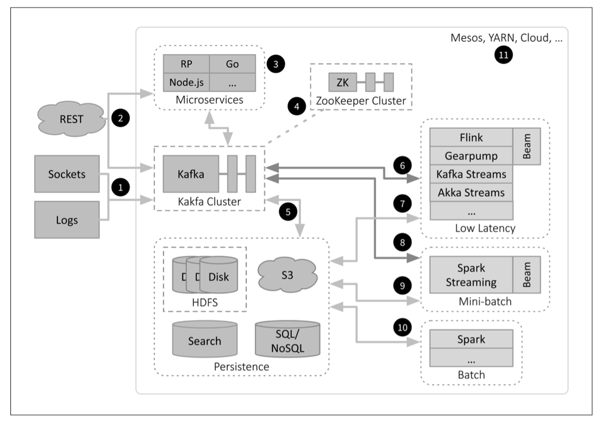

```{r setup, include=FALSE}
knitr::opts_chunk$set(echo = TRUE)

if(system("hostname", intern=TRUE) == "gben3001.hpc.wvu.edu"){
  user <- "eharner"
  } else user <- "rstudio"
```

## Overview

Hadoop and its related projects are central to the big-data revolution of the last 10 years. The ability to reliably and efficiently distribute data in persistent storage across commodity computers and to bring computational algorithms to this data greatly increased the information of the sources. The addition of projects to the Hadoop ecosystem extended the range of both the storage types and the applicable machine learning techniques. Hadoop streaming using R scripts is presented as an alternative to the Java API for performing MapReduce jobs.

## Objectives

By the end or this module, students will be able to:

1. Contrast Hadoop batch architectures with streaming architectures.  
2. Import data into hdfs from the command line.  
3. Use YARN to manage Hadoop resources.  
4. Develop MapReduce jobs using R scripts.  
5. Run MapReduce jobs from the command line.  
6. Contrast Hadoop streaming with the Java API.  
7. Work with binary data in Hadoop.  
8. Import data from databases into hdfs using Sqoop.
9. Import streaming data into hdfs using Flume.  
10. Build data warehouses in Hadoop with Hive.  
11. Build column-oriented databases in Hadoop with HBase.
12. Serialize data using Avro.

## 4.1 Hadoop

#### [Video on Big-Data and Streaming Architectures](http://www.stat.wvu.edu/~jharner/courses/buda515/videos/m4/HadoopArch.mp4)

Hadoop is an open-source framework for large-scale data storage and distributed computing, built on the MapReduce model. Doug Cutting created Hadoop as a component of the Nutch web crawler. It became its own project in 2006, and graduated to a top-level Apache project in 2008.

It is a general framework, applicable to a variety of domains and programming languages. One use case is to drive large R jobs.

An overview of the Hadoop ecosystem as implemented in the Hortonworks Data Platform (HDP) is given here: [Hortonworks Data Platform](http://hortonworks.com/products/data-center/hdp/). It is based on a centralized architecture (YARN). Hadoop supports many technologies built on YARN, including MapReduce and Spark.

Batch data is collected and ingested into HDFS using Flume or Sqoop. Analysis jobs, written in Hadoop MapReduce, Spark, or other tools, are submitted to the Resource Manager for YARN, which decomposes each job into tasks that are run on the worker nodes, managed by a Node Manager. Even for interactive tools like Hive and Spark SQL, the same job submission process is used when the actual queries are executed as jobs. See O'Reilly's [Fast Data Architectures for Streaming Applications](http://www.oreilly.com/data/free/fast-data-architectures-for-streaming-applications.csp), which contrasts batch processing with stream processing.


`gofirst` approximate this batch architecture, but lacks certain components at this time.

Hadoop's primary use is for big-data tasks involving extract-transform-load (ETL), image processing, data modeling, machine learning, etc.

The Hadoop ecosystem is generally used for data-at-rest, but it also supports data-in-motion, e.g., [Hortonworks DataFlow (HDF)](http://hortonworks.com/products/). This allows real-time data to be collected and analyzed, e.g., sensor data and log files. This is becoming increasingly important due to the rise of the Internet of Things (IoT). Streaming data is collected and ingested into HDFS or sent directly to a stream processing engine using Kafka, a real-time messaging system, for analysis and rendering using tools such as Spark Streaming or Flink.



Both the batch and streaming architectures will be discussed in more depth in the videos, but I suggest you read the O'Reilly publication mentioned above. A somewhat different approach is presented in O'Reilly's [The Path to Predictive Analytics and Machine Learning](http://www.oreilly.com/data/free/the-path-to-predictive-analytics-and-machine-learning.csp)

This streaming architecture is not feasible at this time for `gofirst` due to resource limitations. Within an educational setting it is probably best implemented using [Docker containers](https://www.docker.com) scaled and orchestrated by [kubernetes](http://kubernetes.io). For a start in this direction see: [jharner/hadoop-docker](https://github.com/jharner/hadoop-docker).

We are running a [Cloudera distribution](http://www.cloudera.com/products/apache-hadoop.html) on `gofirst`. In many ways the Hortonworks and Cloudera distributions are similar, but the support tools are specific to the platform. Cloudera also supports [data in motion](http://www.cloudera.com/campaign/data-in-motion.html).

Hadoop is also a framework for parallel processing for compute intensive tasks. The idea is to:  

* decompose a problem into independent units of work;  
* distribute the work across a cluster of machines. 

Hadoop is based on three principal components:    

* the *Hadoop Distributed File System* (HDFS);  
* the *data operating system* (YARN);  
* the *MapReduce model*.  

These Hadoop components will now be discussed along with several supporting systems.

## 4.2 HDFS

#### [Video on HDFS and YARN](http://www.stat.wvu.edu/~jharner/courses/buda515/videos/m4/YARN.mp4)

When data sets exceed the storage capacity of a single physical machine, we can spread them across a number of machines. Filesystems that manage the storage across a network of machines are called *distributed filesystems*. Since they are network based, the complications of network programming arise, e.g., experiencing node failures without data loss. Thus, distributed filesystems are more complex than regular disk filesystems.

HDFS is Hadoop’s main filesystem, but it has a general-purpose filesystem abstraction. Thus, Hadoop integrates with other storage systems, e.g., the local filesystem and Amazon S3.

### 4.2.1 HDFS Design

HDFS is a filesystem designed for storing very large files with streaming data access patterns, running on clusters of commodity hardware.  

* Very large files: Many [data lakes](https://en.wikipedia.org/wiki/Data_lake) are in the gigabytes, terabytes, or even petabytes in size.  
* Streaming data access: HDFS is built around the idea that the most efficient data processing pattern is a write-once, read-many-times pattern. A dataset is typically generated or copied from source, and then various analyses are performed on that dataset over time.  
* Commodity hardware: Hadoop doesn’t require expensive, highly reliable hardware. It’s designed to run on clusters of commodity hardware for which the chance of node failure across the cluster is high, at least for large clusters. 

Files in HDFS are broken into block-sized chunks (128 MB by default), which are stored as independent units. Unlike a filesystem for a single disk, a file in HDFS that is smaller than a single block does not occupy a full block’s worth of underlying storage. HDFS blocks are large to minimize the cost of seeks. 

Having a block abstraction for a distributed filesystem brings several benefits over a file abstraction:  

* a file can be larger than any single disk in the network;
* the storage is easy to manage, e.g., relating to disk failure;  
* replication allows fault tolerance and availability.  

HDFS’s `fsck` (file system check) command understands blocks:
```
hdfs fsck / -files -blocks
```

An HDFS cluster has two types of nodes operating in a master−worker pattern:  

* a namenode (the master);  
* a number of datanodes (workers).  

The namenode manages the filesystem namespace. Datanodes store and retrieve blocks when they are told to (by clients or the namenode), and they report back to the namenode periodically with lists of blocks that they are storing. A client accesses the filesystem on behalf of the user by communicating with the namenode and datanodes. 

### 4.2.2 HDFS Input/Output

As a user you must interact with both the *local filesystem* and *hdfs*. Locally, you use standard Linux commands, e.g., `cd`, `rm`, etc. Many regular filesystems commands have similar functionality in hdfs, but the syntax is different and certain limitations exist since hdfs is *stateless*, e.g., there is no `cd` command. 

You can experiment in the shell with the following scripts:
```
# show the hdfs commands
hdfs

# show the options for the dfs command
hdfs dfs
```
Alternately, you can use `hadoop fs` to issue commands.

The `hdfs` command of interest is `dfs` which runs a filesystem command on the file systems supported in Hadoop. The format of the commands involving the distributed file system is:  
```
hdfs dfs <options>  
```

For example, we can list the files and directories with a `-ls` option, make a directory with the `-mkdir` option, etc.
```
# make sure you are in M4_DataLoad in your local filesystem
pwd
cd M4_DataLoad
ls -al

# list the files on hdfs
hdfs dfs -ls

# make a new directory, populate it, import a file, and 
# then remove the file and directory
hdfs dfs -mkdir temp
hdfs dfs -copyFromLocal cdat.csv temp/cdat.csv
hdfs dfs -ls
hdfs dfs -du
hdfs dfs -rm -f temp/cdat.csv
hdfs dfs -rmdir temp
hdfs dfs -ls
```
These commands illustrate how data can be loaded from the local filesystem into hdfs. In the next module we will illustrate how to load date into hdfs from within R. However, in a production system data would typically be loaded into hdfs using Sqoop as an interface to a database or Flume for real-time data.

HDFS has a permissions model for files and directories that is much like the POSIX model.

The `rhdfs` package in RHadoop provides basic connectivity to the Hadoop Distributed File System. R programmers can browse, read, write, and modify files stored in HDFS from within R.

## 4.3 YARN

YARN (Yet Another Resource Negotiator) is Hadoop’s cluster resource management system. YARN provides APIs for requesting and working with cluster resources.

YARN provides its core services via two types of long-running daemons:  

* a resource manager (one per cluster) to manage the use of resources across the cluster, and  
* node managers running on all the nodes in the cluster to launch and monitor containers.

A container executes an application-specific process with a constrained set of resources (memory, CPU, and so on). See the Batch Architecture diagram above. 

YARN has a flexible model for making *resource requests*. A request for a set of containers can express the amount of computer resources required for each container (memory and CPU), as well as *locality constraints* for the containers in that request. *Locality* is critical in ensuring that distributed data processing algorithms use the cluster bandwidth efficiently. The idea is to bring the algorithm to the data rather than moving data.

YARN allocates resources to applications according to some defined policy. YARN has three schedulers:  

* FIFO: the order of submission (first in, first out);  
* Capacity; a separate dedicated queue allows the small job to start as soon as it is submitted;  
* Fair Scheduler: dynamically balance resources among all running jobs.

## 4.4 MapReduce

#### [Video on MapReduce](http://www.stat.wvu.edu/~jharner/courses/buda515/videos/m4/MapReduce.mp4)

The MapReduce model outlines a way to perform work across a cluster of inexpensive, commodity machines.

Two phases:  

* Map phase: divides input data and groups the pieces into smaller, independent piles of related material;     
* Reduce phase: perform some action on each pile.     

MapReduce is a “divide-and-conquer” model. The piles can be reduced in parallel because they do not rely on one another.

Map Phase:  

1. Each cluster node runs a part of the initial big data and runs a Map task on each record (item) of input.  
2. The Map task runs in parallel and creates a *key/value* pair for each record. The key identifies the items pile for the reduce operation. The value is often the record itself.  

The Shuffle:   

Each key/value pair is assigned a pile based on the key.

Reduce Phase:  

1. The cluster nodes then run the Reduce task on each pile.   
2. The Reduce task typically emits output for each pile.   

See Figure 5.1. in the Parallel R book.

#### Pseudocode Examples

For these examples, we will use a fictitious text input format in which each record is a comma-separated line that describes a phone call:  

  {id}, {date}, {caller_num}, {caller_carrier}, {dest_num}, {dest_carrier}, {length}

#### Calculate the average call length for each date

The Map task groups the records by `date`, and then calculates the mean (average) call length in the Reduce task.

Map task:  

* Receives a single line of input (that is, one input record)  
* Uses text manipulation to extract the {date} and {length} fields  
* Emits key: {date}, value: {length}  

Reduce task:  

* Receives the key: {date}, value:{length1 ... lengthN} i.e., each reduce task receives all of the call lengths for a single date based on the shuffle  
* Loops through {length1 ... lengthN} to calculate total call length, and also to note the number of calls  
* Calculates the mean (divides the total call length by the number of calls)   
* Outputs the date and the mean call length  

#### Number of Calls by Each User, on Each Date

The goal is to get a breakdown of each caller for each date. The Map phase will define the keys to group the inputs, and the Reduce task will perform the calculations. Notice that the Map task emits a dummy value (the number 1) as its value because we use the Reduce task for a simple counting operation.

Map task:  

* Receives single line of input  
* Uses text manipulation to extract {date}, {caller num}  
* Emits key: {date}{caller num}, value: 1  

Reduce task:  

* Receives key: {date}{caller num}, value: {1 ... 1}  
* Loops through each item, to count total number of items (calls)  
* Outputs {date}, {caller num} and the number of calls  

#### Binary and Whole-File Data: SequenceFiles

You’re in a different situation if you plan to use Hadoop with binary data (sound files, image files, proprietary data formats) or if you want to treat an entire text file (e.g., XML document) as a record.

By default, when you point Hadoop to an input file, it will assume it is a text document and treat each line as a record. There are times when this is not what you want: maybe you’re performing feature extraction on sound files, or you wish to perform sentiment analysis on text documents. 

Use a special archive called a *SequenceFile*. A SequenceFile is similar to a zip or tar file, in that it’s just a container for other files. Hadoop considers each file in a SequenceFile to be its own record.

To manage zip files, you use the `zip` command. Tar file? Use `tar`. SequenceFiles? Hadoop doesn’t ship with any tools for this, but you still have options: you can write a Hadoop job using the Java API; or you can use the `forqlift` command-line tool. 

`forqlift` strives to be simple and straightforward. For example, to create a SequenceFile from a set of MP3s, you would run:
```
forqlift create --file=/path/to/file.seq *.mp3
```  
Then, in a Hadoop job, the Map task’s key would be an MP3’s filename and the value would be the file’s contents.

#### Running MapReduce Jobs

MapReduce jobs are run on a Hadoop cluster, which can be built locally, e.g., `gofirst`, or by using a cloud service, e.g., Amazon Web Service (AWS). In the next subsection we will run several MapReduce jobs on `gofirst` using Hadoop Streaming.

AWS provides computing resources such as virtual servers and storage in *metered* (pay-per-use) way. You can hand-build your cluster using virtual servers on Elastic Compute Cloud (EC2), or you can leverage the Hadoop-on-demand service called Elastic MapReduce (EMR).

An EMR-based cluster is designed to be ephemeral: by default, AWS tears down the cluster as soon as your job completes. All of the cluster nodes and resources disappear. That means you can’t leverage HDFS for long-term storage.

## 4.5 Hadoop Streaming

#### [Video on Hadoop Streaming (Ex1)](http://www.stat.wvu.edu/~jharner/courses/buda515/videos/m4/HadoopEx1.mp4)

The following are two ways to submit work to a Hadoop cluster:  

* *Streaming*: Write the Map and Reduce operations as R scripts (or in another scripting language). The Hadoop framework launches the R scripts at appropriate times and communicates by standard input and standard output.  

* *Java API*: Write the Map and Reduce operations in Java.  

The Java code runs `Runtime.exec()` to invoke the R scripts. The appropriate method depends on several factors, including your understanding of Java versus R, and the particular problem you’re trying to solve. 

* Streaming tends to win for rapid development.  
* Java API is useful for working with data such as images or sound files.  

### 4.5.1 Ex1: Simple Hadoop Streaming

Setting: The input data is several million lines of plain-text phone call records. Each CSV input line is of the format:
```
  {id}, {date}, {caller_num}, {caller_carrier}, {dest_num}, {dest_carrier}, {length}
```
The plan is to analyze each call record separately, so there’s no need to sort and group the data. The job is run with only a mapper R script and a follow-up analysis R script.

mapper.R
```
#! /usr/bin/env Rscript

input <- file( "stdin" , "r" )

while( TRUE ){

	currentLine <- readLines( input )
	if( 0 == length( currentLine ) ){
		break
	}

	currentFields <- unlist( strsplit( currentLine , "," ) )
	result <- paste( currentFields[3] , currentFields[7], sep="\t" )
	cat(result, "\n")
}

close( input )
```

Hadoop Streaming sends input records to the `mapper.R` script via standard input. A Map script receives one or more input records in a single call (the default for `readLines` is one record at a time); we read from standard input until there’s no more data, i.e., when `0 == length( currentLine )`.

Ideally, each incoming line is split among the nodes to gain parallelism. This did not happen here due to hdfs's block size since `short.csv` only has 100 observations. Also, see the `output` directory which only has one part.

Each comma-separated input line is split into a list using `strsplit`, but is then unlisted and becomes a character vector. The third (`call_num`) and seventh fields are pasted together to form the key-value pair, which in this case are:  

key: `call_num`  
value: `length`

`cat` then write the key-value pairs to standard output, which could be send to a reducer or, as in this case, to further analyses.

#### Run the Hadoop job from the command line.

The Hadoop job can be run from the shell line-by-line, but it is more efficient to build a `bash` script. Before running this scrip, you need to be in the `RhadoopEx1` directory by clicking down the directory hierarchy in the `Files` tab. Then click on `ex1.sh` to open it in the `Source` panel. You also need to set R's working directory to `RhadoopEx1` either by selecting `Set As Working Directoy` in the `More` dropdown menu or by executing a `setwd` function. In my case I am in:
```
~/BUDA515/Modules/M4_DataLoad/RhadoopEx1
```

The Java code runs `Runtime.exec()` to invoke the R scripts. The shell script to execute the job is:  

ex1.sh  
```
#!/usr/bin/env bash

# remove the output directory from hdfs and the local file system
hdfs dfs -rm -r -f output  # this is essential
rm -rf output

# load the data into hdfs
# for efficiency comment the following line after the first execution of this shell script
hdfs dfs -put -f short.csv 

# run the hadoop job
hadoop jar $HADOOP_MAPRED_HOME/hadoop-streaming.jar \
  -files mapper.R \
  -inputformat org.apache.hadoop.mapred.lib.NLineInputFormat \
	-input short.csv -output output \
	-mapper mapper.R 

# get the output from hdfs
hdfs dfs -get output
```
First, we remove `output` from both the local filesystem and hdfs. Then we `put` the data file `short.csv` into hdfs. Next we run `hadoop` with the `jar` command. When using `NLineInputFormat` as the `inputformat`, Hadoop treats each line as a split and spreads the work evenly throughout the cluster. The `input`, `output`, and `mapper` files or directories are also options. There is no `reducer` file in this example. The code in `mapper.R` will be reviewed in the video.

#### Review the output.

A typical Hadoop job will create several files, one for each Reduce operation. Since this is a Map-only job, there is just one file. If the output file is compressed, you will need to uncompress it, e.g., using `gunzip`.

If you find stray content in your job’s output, you can post-process those files, e.g., `grep` the job output file to extract the lines of interest. Or you can suppress certain output using `sink()` in your code.
```
sink( "/dev/null" ) ## suppress standard output
  ... do the work ...
sink() ## restore standard output
cat( ... your intended result ... )
  ... exit the script
```

In our case we will process the output file by computing the mean call length for each call number. Load `analysis.R` into the Source panel and the select `Source with Echo` from the `Source` dropdown menu. Alternatively, you can go to the shell and specify:
```
./analysis.R
```
assuming you are in the `RhadoopEx1` directory. We get a names vector with the call number as the name and the average length as the value.

#### Prototyping A Hadoop Streaming Job

For streaming jobs, you can chain the scripts with pipes to simulate a workflow. For Ex1 the command sequence is:
```
cat short.csv | ./mapper.R | sort | ./analysis.R
```
Of course the computations are done sequentially, but is does allow your logic to be checked.

More generally, the pipeline would look like:
```
cat input-sample.txt | ./mapper.R | sort | ./reducer.R
```
See the Ex2 files.

### 4.5.2 Ex2: Processing Related Groups using Full Map/Reduce  

#### [Video on Processing Related Groups (Ex2)](http://www.stat.wvu.edu/~jharner/courses/buda515/videos/m4/GroupedEx2.mp4)

Setting: You want to collect related records and operate on that group as a whole. Returning to the “phone records” example, let’s say you want to analyze every number’s output call patterns. That would require you to first gather all of the calls made by each number (Map phase) and then process those records together (Reduce phase).

The code: As noted above, this will require both the Map and Reduce phases. The Map phase code will extract the caller’s phone number to use as the key. 

mapper.R:
```
#! /usr/bin/env Rscript

input <- file("stdin", "r")

while(TRUE){

	currentLine <- readLines(input, n=1)
	if(0 == length(currentLine)) break

	currentFields <- unlist( strsplit(currentLine , ","))
	result <- paste(currentFields[3], currentFields[7] , sep="\t")
  cat(result, "\n")
}

close(input)
```
The third field in the comma-separated line is the caller’s phone number, which serves as the key output from the Map task, whereas the 7th field is the call length, which serves as the value.

The Reducer code builds a `data.frame` of all calls made by each number, and then passes the `data.frame` to the analysis function to compute the average call length. This example is the same as Example 1 except that the average length is computed by the reduce phase rather than an external file, i.e., outside of Hadoop.

In a Reducer script, each input line is of the format:  
```
  {key}{tab}{value}
```
where `{key}` and `{value}` are a single key/value pair, as output from a Map task.

The Reducer’s job is to collect all of the values for a given key, then process them together. Hadoop may pass a single Reducer values for multiple keys, but it will sort them first. When the key changes, then, you know you’ve seen all of the values for the previous key. You can process those values as a group, then move on to the next key.

reducer.R
```
#! /usr/bin/env Rscript

input <- file("stdin" , "r")
lastKey <- ""

tempFile <- tempfile(pattern="hadoop-mr-demo" , fileext="csv")
tempHandle <- file(tempFile , "w")

while(TRUE){

	currentLine <- readLines(input , n=1)
	if(0 == length(currentLine)){
		break
	}

# break this apart into the key and value that were
# assigned in the Map task
	tuple <- unlist(strsplit(currentLine, "\t"))
	currentKey <- tuple[1]
	currentValue <- tuple[2]

	if(currentKey != lastKey))){
# a little extra logic here, since the first time through,
# this conditional will trip

		if(lastKey != ""){
# we've hit a new key, so first let's process the
# data we've accumulated for the previous key:
	
# close tempFile connection
			close(tempHandle)
	
# read file of accumulated lines into a data.frame
			bucket <- read.csv(tempFile , header=FALSE)
	
# process data.frame and write result to standard output
			result <- apply(as.matrix(bucket[1]), 2, mean)
	
# write result to standard output
			cat(lastKey , "\t" , result , "\n")
	
# cleaup, and start fresh for the next round
			tempHandle <- file(tempFile , "w")
		}
	  
	  lastKey <- currentKey

	}
	
# by now, either we're still accumulating data for the same key
# or we have just started a new file.  Either way, we dump a line
# to the file for later processing.
  cat(currentValue , "\n" , file=tempHandle, append=TRUE)
	
}

## handle the last key, wind-down, cleanup
close(tempHandle)

bucket <- read.csv(tempFile , header=FALSE)
result <- apply(as.matrix(bucket[1]), 2, mean)
cat(currentKey , "\t" , result , "\n")

unlink(tempFile)

close(input)
```
This MapReduce job is doing the exact same computation as Ex1 except a reducer is used rather than an analysis Rscript. The dataset is the same as in Example 1 so the results can be compared.  Once data frames are formed for each call, the analysis could be much more complex. The `mapper.R` and `reducer.R` code will be explained in the video although the comments in the code should help.

The bash script for running the job centers around the `hadoop jar` command.  

ex2.sh
```
#!/usr/bin/env bash

# remove output from hdfs and the local filesystem
hdfs dfs -rm -r -f output
rm -rf output

hdfs dfs -put -f short.csv

hadoop jar $HADOOP_MAPRED_HOME/hadoop-streaming.jar \
  -files mapper.R,reducer.R \
  -inputformat org.apache.hadoop.mapred.lib.NLineInputFormat \
	-input short.csv -output output \
	-mapper mapper.R -reducer reducer.R

# get output from hdfs
hdfs dfs -get output
```
AS before the `output` directories are removed from both hdfs and the local filesystem. The call data (`short.csv`) is then uploaded to hdfs and the `hadoop` command it issued. The `output` directory is then downloaded.

The results for both examples 1 and 2 are identical except that the format is different. A larger input file, `cdat2.csv` is also available for experimentation.

#### Caveats:

Typically, the Map phase is very lightweight (since it’s just used to assign keys to each input) and the heavy lifting takes place in the Reduce operation. To take advantage of the parallelism of the Reduce stage, you’ll need to meet two conditions:  

1. A large number of unique keys output from the Map phase;  
2. Each key should have a similar number of records (at least, no one key should clearly dominate).  

Hadoop splits the work across a cluster, sending each unit of work to a different node even though R itself is single-threaded, this allows the use of tens or hundreds of CPUs. 

Hadoop is not completely spared from the memory wall.

> Hadoop is a compute solution, not a memory grid. 

Needs infrastructure  

> R+Hadoop works best if you already have access to an in-house cluster. Elastic MapReduce, the cloud-based solution, runs a close second.

Needs consistent cluster nodes  

> Hadoop executes your R scripts for you, and for streaming jobs it will even copy the R scripts to the cluster for you. It’s otherwise up to you to keep the runtime environment consistent across the cluster.

R+Hadoop gives you the most control and the most power, but comes at the cost of a Hadoop learning curve.

### 4.5.3 Java Word Count

#### [Video on the Java API and Binary Data](http://www.stat.wvu.edu/~jharner/courses/buda515/videos/m4/WordCount.mp4)

For the Java API, the Map and Reduce operations are written in Java. The Java code runs `Runtime.exec()` to invoke R scripts, if needed. The canonical example is counting the number of occurrences of each word in one or more files. The `WordCount.java` file contains the source for the mapper and the reducer. The contents of this file will be explained in the video. The `data` directory contains four files containing words.

The output file contains a count of the number of occurrences for each word.

### 4.5.4 Working with Binary Data

Hadoop Streaming can only be used for text input and output. This doesn’t preclude you from working with binary data in a streaming job; but it does preclude your Map and Reduce scripts from accepting binary input and producing binary output. Note that the Java API does work with binary data.

Setting: Imagine that you want to analyze a series of image files. Perhaps they are frames from a video recording, or a file full of serialized R objects, or maybe you run a large photo-sharing site. For this example, let’s say you have R code that will perform image feature extraction. 

The code: Hadoop Streaming can only handle line-by-line text input and output. One option would be to feed your Hadoop Streaming job an input of pointers to the data, which your R script could then fetch and process locally. For example:  

* Host the data on an internal web server, and feed Hadoop a list of URLs;  
* Use an NFS mount;  
* Use `scp` to pull the files from a remote system;  
* Make a SQL call to a database system.  

HDFS does’t work well with small files.

```
#! /usr/bin/env Rscript
input <- file( "stdin" , "r" )
while( TRUE ){
  currentLine <- readLines( input , n=1 )
  if( 0 == length( currentLine ) ){ break
  }
  
  pulledData <- url( currentLine ) )

  result <- imageFeatureExtraction( url( currentLine ) )
  cat( result , "\n" , sep="" )
}
close( input )
```

Run the Hadoop job as before.

#### Review the Output.

if your job yields binary output, you can use the same idea as you did for the input, and push the output to another system:  

* Copy it to an NFS mount;  
* Use an HTTP POST operation to send the data to a remote web server;  
* Call `scp` to ship the data to another system;  
* Use SQL to push the data to an RDBMS.  

#### Caveats

A Hadoop cluster is robust, i.e., on the software-side framework and the required hardware layout, you are protected from hard disk failures, node crashes, and even loss of network connectivity.

Everything required for the job must *exist within the cluster*. Map and Reduce scripts, input data, and output must all live in HDFS (S3 if you are using Elastic MapReduce).

For systems or services outside of the cluster, you lose in four ways:  

* Loss of robustness  

> Hadoop can’t manage a failure or crash in a remote service.

* Scaling  

> The remote web server or NFS mount may fail under the weight of a Hadoop-inflicted flood of activity.

* Overhead  

> Any of the methods described above—SSH, web server, NFS mount—requires additional setup.

* Idempotence/risk of side effects  

> Hadoop may employ speculative execution, i.e., Hadoop might run a given Map or Reduce task more than once. Hadoop may kill a task in mid-run and launch it elsewhere (if it detects a timeout) or it may concurrently launch a duplicate task (if the first task seems to be taking too long to complete).

> When you leverage data or services from outside the cluster, those are considered side effects of a task. Hadoop doesn’t know what your Map or Reduce code is doing; it only knows how long it takes to run, and whether it meets Hadoop’s criteria for success or failure. That means it’s up to you to handle side effects such as duplicate submissions to that remote web server.

The `rmr2` package in RHadoop allows R developer to perform statistical analysis in R via Hadoop MapReduce functionality on a Hadoop cluster. 

## 4.6 Data Import

#### Video on Data Import

Loading data into hdfs, or other persistent data stores such as HBase, generally is not done by copying data from the local filesystem to hdfs. If the data fits in the local filesystem, it probably does not need to be analyzed in Hadoop.

Within the framework of a batch architecture, such as `gofirst`, the two most common systems for loading data are Sqoop and Flume. At this time, neither are implemented, but we will discuss their use cases.

### 4.6.1 Sqoop

Sqoop performs ETL processing by transferring data from a relational database, or other structured datastore, to HDFS. Sqoop can also be used to extract data from Hadoop and export it into external structured datastores. Sqoop works with the major databases, including PostgreSQL. Sqoop leverages Hadoop’s execution engine, MapReduce, to perform data transfers. 

Importing data into HDFS would look something like this:
```
sqoop import \
  --connect jdbc:postgresql://url/dataexpo \ 
  --username sqoop \
  --password sqoop \
  --table location_table
```
A directory will be created called `location_table` with a csv file containing the data. It is possible to specify the target directory rather than using your home directory. The password can hidden by a password file or by prompt.

The user can import subsets of the data (using the `-where` option,  or incrementally import mutable data. It is also possible to import all tables or join tables (using a `--query` option with `SELECT`). Finally binary data can be imported. 

Data can also be imported directly into Hive or HBase. The additional option `--hive-import` is used for Hive. For HBase, use the `--hbase-table location_table` and `--column-family` options.

The `sqoop export` command can be used to export data from HDFS to a relational database.

### 4.6.2 Flume

Flume is a distributed service for efficiently collecting, aggregating, and moving large amounts of streaming data into HDFS. It has a simple and flexible architecture based on streaming data flows; and is robust and fault tolerant with reliability mechanisms for failover and recovery.

Flume allows HDFS and HBase clusters to handle bursts of data without having the capacity to handle that rate of writes continuously. These systems act as a buffer between the data producers and the final destination (HDFS or HBase) allowing a steady state of flow. 

Flume’s HDFS and HBase sinks provide features that makes it possible to write data in any format that is supported by these systems in a MapReduce friendly way. 

The simplest unit of Flume deployment is a Flume *agent*. By connecting multiple Flume agents to each other, a  *flow* is established. Each Flume agent has three components:  

* the source: gets events into the Flume agent;  
* the channel: is a buffer that stores data that the source has received, until a sink has successfully written the data out to the next hop or the eventual destination;  
* the sink: removes the events from the agent and forwarding them to the next agent in the topology, or to HDFS, HBase, etc.  

Flume agents can be configured to send data from one agent to another to form a *pipeline* before the data is written out to the destination. Generally the workflow is written in Java, but command tools are available.

## 4.7 Hive

#### Video on Hive, HBase, and Avro

Hive is a data warehouse infrastructure built on HDFS that provides data querying and data summarization. It provides facilities for reading, writing, and managing large datasets residing in distributed storage using SQL.

Hive was created to make it possible for analysts with strong SQL skills (but meager Java programming skills) to run queries on the huge volumes of data stored in HDFS. SQL isn’t a good fit for building complex machine-learning algorithms, but it’s great for many analyses, and it has the huge advantage of being very well known in the industry and it is the *lingua franca* in business intelligence tools.

The Hive shell is the primary way to interact with Hive, by issuing commands in HiveQL, Hive’s query language, a dialect of SQL. It is heavily influenced by MySQL, so if you are familiar with MySQL, you should feel at home using Hive.

In the shell type `hive` to launch the hive shell:
```
hive
```
However, the installation is not complete and thus we are very limited in what can be dome.

Here is a simple example of interfacing with hive from R:
```{r}
library(RJDBC)
cp = c(list.files("/opt/hadoop/lib", pattern="jar$", full.names=T),
       list.files("/opt/hive/lib", pattern="jar$", full.names=T),
       list.files("/opt/hadoop", pattern="jar$", full.names=T))
.jinit(classpath=cp)

hivedrv <- JDBC("org.apache.hive.jdbc.HiveDriver",
                "/opt/hive/lib/hive-jdbc-2.1.1.jar", identifier.quote="`")

conn <- dbConnect(hivedrv, "jdbc:hive2://hive:10000/default", user=user)

show_tables <- dbGetQuery(conn, "show tables")
show_tables
query <- "select * from pokes LIMIT 10"
dbGetQuery(conn, query)
```
Again it is seen that the Hive installation is incomplete.

Hive has many advantages:  

1. Ability to handle structured and unstructured data;  
2. Real-time streaming of data into Hive from Flume;  
3. Extend functionality through user-defined functions;  
4. A well-documented, SQL-like interface specifically built for OLAP versus OLTP.  

## 4.8 HBase

A scalable, distributed database that supports structured data storage for large tables.

HBase is not a column-oriented database in the RDBMS sense, but utilizes an on-disk column storage format. Although HBase stores data on disk in a column-oriented format, it is distinctly different from traditional columnar databases: whereas columnar databases excel at providing real-time analytical access to data, HBase excels at providing key-based access to a specific cell of data, or a sequential range of cells.

The most common filesystem used with HBase is HDFS, but you are not locked into HDFS because the filesystem used by HBase has a pluggable architecture.

HBase can be used from the command line for basic operations, such as adding, retrieving, and deleting data. To start simply type `hbase` into the shell.

The `rhbase` package in RHadoop provides basic connectivity to the HBASE distributed database, using the Thrift server. R programmers can browse, read, write, and modify tables stored in HBASE from within R. 
```
library(rhbase)
hb.init(host="hadoop", port=9000)
```

## 4.9 Avro

A data serialization system. It provides:   

* rich data structures;  
* a compact, fast, binary data format;  
* a container file to store persistent data;  
* remote procedure calls (RPC);  
* simple integration with dynamic languages.  

Avro relies on schemas. When Avro data is read, the schema used when writing it is always present. This permits each datum to be written with no per-value overheads, making serialization both fast and small. This also facilitates use with dynamic, scripting languages, since data, together with its schema, is fully self-describing.

Avro is written in Java, but is can be accessed from the command line using the `hadoop` command. The `ravro` package in RHadoop adds the ability to read and write avro files from local and HDFS file systems and adds an avro input format for `rmr2`.

## Learning Activities

The assignment for modules 4 and 5 will be combined and given at the time Module 5 is covered.

## Assessments

Quiz 4 will be sent as a separate file.

## Discussion Questions

Keywords for the Subject field are given first.

1. Architectures: Do you think the streaming architecture (as shown in the diagram) will gradually relegate the batch architecture (the other diagram) to a supporting role? (You might want to download O’Reilly’s Fast Data Architectures for Streaming Applications.)  

2. HDFS: What feature of HDFS have led to its widespread adoption as a distributed filesystem?

3. Streaming: What are the advantage and disadvantages of using Hadoop streaming rather than using the Java API?

## Reading Assignments

The books below are available in O'Reilly Books Online:

*Hadoop: The Definitive Guide*,  Tim White, O'Reilly, 4th Edition, Chapters 2, 3, 4, 12, 14, 15, 17, 20.

*Parallel R*, Q. Ethan McCallum and Stephen Weston, O'Reilly, Chapters 5, 6.

*Apache Sqoop Cookbook*, Kathleen Ting and Jarek Jarcec Cecho, O'Reilly.

*Using Flume*, Hari Shreedharan, O'Reilly.

*Programmng Hive: Data Warehouse and Query Language for Hadoop*, Edward Capriolo, Dean Wampler, and Jason Rutherglen, O'Reilly.

*HBase: The Definitive Guide*, Lars George, O'Reilly, 2nd Edition.


