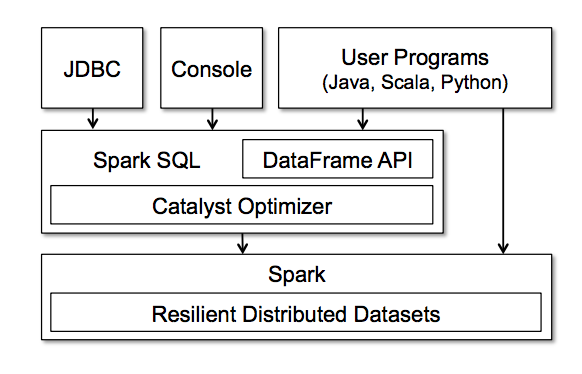

```{r setup, include=FALSE}
knitr::opts_chunk$set(echo = TRUE)
# knitr::opts_chunk$set(cache=TRUE)

if(system("hostname", intern=TRUE) == "gben3001.hpc.wvu.edu"){
  hdfs.path <- "/user/eharner";
  spark.master <- "yarn-client"
  } else {
    hdfs.path <- "/user/rstudio";
    spark.master <- "local"}

if(system("hostname", intern=TRUE) == "gben3001.hpc.wvu.edu"){
  host.name=""
  } else {
    host.name="postgres"
  }
```

## Overview

This module explains the design and features of the Spark big-data computational platform. This includes workflows for data manipulation, machine learning, stream processing, and graph processing. The internally supported SparkR R interface is described and illustrated. The data flow interface based on `dplyr` and `sparklyr` is also developed.

## Objectives

By the end or this module, students will be able to:

1. Identify and use the components of the Spark ecosystem;
2. Contrast Spark to Hadoop;
3. Understand the components of the Spark Architecture;
4. Extract data from relational databases into Spark;
5. Build workflows based on both R and Spark data frames;
6. Use `SparkR` for data manipulation and machine learning;
7. Use `sparklyr` for data manipulation and machine learning.

## 6.1 Spark Overview

#### [Video on Spark](http://www.stat.wvu.edu/~jharner/courses/buda515/videos/m6/Spark.mp4)

[Spark](http://spark.apache.org/docs/latest/programming-guide.html#overview) is a fast, general-purpose cluster computing system. It provides high-level APIs in Java, Scala, Python and R, and has an optimized engine that supports a multi-step data pipelines using directed acyclic graphs (DAGs). Since Spark supports in-memory data sharing across DAGs, different jobs can work with the same data.

Spark was originally developed in 2009 in UC Berkeley’s AMPLab, and was open sourced in 2010 as an Apache project.

Spark provides a unified framework to manage big data processing with a variety of data sets that are diverse in nature (e.g., text data, graph data, etc.) as well as the source of data (batch vs. real-time streaming data).

#### Hadoop and Spark

Hadoop's MapReduce is a great solution for one-pass computations, but not very efficient for use cases that require multi-pass computations and algorithms. Each step in the data processing workflow has one Map phase and one Reduce phase and you'll need to convert any use case into a MapReduce pattern to leverage this solution.

The output data between each step in Hadoop has to be stored in the distributed file system before the next step can begin. Hence, this approach tends to be slow due to replication & disk storage. However, Spark is not intended to replace Hadoop but to provide a comprehensive and unified solution to manage different big data use cases and requirements.

#### Spark Features

Spark takes MapReduce to the next level with less expensive shuffles in the data processing. With capabilities like in-memory data storage and near real-time processing, the performance can be several times faster than other big data technologies.

Spark also supports lazy evaluation of big data queries, which helps with optimization of the steps in data processing workflows. It provides a higher level API to improve developer productivity and a consistent architect model for big data solutions.

Spark holds intermediate results in memory rather than writing them to disk which is very useful especially when you need to work on the same dataset multiple times. It’s designed to be an execution engine that works both in-memory and on-disk. Spark operators perform external operations when data does not fit in memory. Spark can be used for processing datasets larger than the aggregate memory in a cluster.

Spark will attempt to store as much data as possible in memory and only then spills over to disk. It can store part of a data set in memory and the remaining data on the disk. You have to look at individual data use cases to assess the memory requirements. With in-memory data storage, Spark comes with performance advantages.

Spark is written in Scala and runs on the Java Virtual Machine (JVM) environment. It currently supports the following languages for developing applications using Spark: Scala, Java, Python, Clojure, and R. It has an interactive shell for Scala, Python, and R.

#### Spark Ecosystem

Spark supports a rich set of higher-level tools including:   

* *Spark SQL* for running SQL-like queries on Spark data using the JDBC API. Spark SQL allows the users to extract data from different formats (e.g., JSON, Parquet, a Database), transform it, and load it for ad-hoc querying, i.e., ETL. 

* *MLlib* for machine learning, including classification, regression, clustering, collaborative filtering, dimensionality reduction, as well as underlying optimization primitives.

* *GraphX* for graph processing. GraphX extends the Spark RDD by introducing the Resilient Distributed Property Graph: a directed multi-graph with properties attached to each vertex and edge. To support graph computation, GraphX exposes a set of fundamental operators (e.g., `subgraph`, `joinVertices`, and `aggregateMessages`) as well as an optimized variant of the Pregel API. In addition, GraphX includes a growing collection of graph algorithms and builders to simplify graph analytics tasks.   

* *Spark Streaming* for processing the real-time streaming data. This is based on the micro batch style of computing and processing. It uses a `DStream` which is basically a series of `RDDs`, to process real-time data.

The Spark ecosystem also supports *BlinkDB* (an approximate query engine and can be used for running interactive SQL queries on large volumes of data), *Tachyon* (a memory-centric distributed file system enabling reliable file sharing at memory-speed across cluster frameworks), and *Cassandra Connector* (to access data stored in a Cassandra database and perform data analytics on that data).

#### Spark Architecture

The Spark Architecture includes following three main components:

* *Data Storage*: Spark uses HDFS file system for data storage purposes, but it works with any Hadoop compatible data source including, HBase, Cassandra, etc.  
* *Compute Interface*: The API allows application developers to create Spark based applications using a standard API interface. Spark provides API for Scala, Java, Python, and R programming languages.

* *Management Framework*: Spark can be deployed as a Stand-alone server or it can be on a distributed computing framework like Mesos or YARN.

#### [Resilient Distributed Datasets](http://spark.apache.org/docs/latest/programming-guide.html#resilient-distributed-datasets-rdds)

The Resilient Distributed Dataset or RDD is the core concept in a Spark framework. RDD is like a table in a database which can hold any type of data. Spark stores data in RDDs on different partitions. They help with rearranging the computations and optimizing the data processing.

They are also fault tolerance because an RDD know how to recreate and recompute the datasets. RDDs are immutable. You can modify an RDD with a transformation but the transformation returns you a new RDD, i.e., the original RDD remains the same.

RDD supports two types of operations:   

* *Transformations*, which return a new RDD. Nothing gets evaluated when you call a Transformation function, it just takes an RDD and returns a new RDD. Some of the Transformation functions are: `map`, `filter`, `flatMap`, `groupByKey`, `reduceByKey`, `aggregateByKey`, `pipe`, and `coalesce`.  

* *Actions*, which evaluates and returns a new value. When an Action function is called on a RDD object, all the data processing queries are computed at that time and the result value is returned. Some of the Action operations are: `reduce`, `collect`, `count`, `first`, `take`, `countByKey`, and `foreach`.

#### [Shared Variables](http://spark.apache.org/docs/latest/programming-guide.html#shared-variables)

Spark provides the following two types of shared variables to make it efficient to run the Spark programs in a cluster.  

* *Broadcast Variables*: allow us to keep read-only variable cached on each machine instead of sending a copy of it with tasks. They can be used to give the nodes in the cluster copies of large input datasets more efficiently.   

* *Accumulators*: are only added using an associative operation and can therefore be efficiently supported in parallel. They can be used to implement counters (as in MapReduce) or sums. Tasks running on the cluster can add to an accumulator variable using the add method.  


[Spark Programming Guide 2.0.1](http://spark.apache.org/docs/latest/programming-guide.html)

## 6.2 SparkR

#### [Video on SparkR](http://www.stat.wvu.edu/~jharner/courses/buda515/videos/m6/SparkR.mp4)

[SparkR](http://spark.apache.org/docs/latest/sparkr.html) is an R package that provides a light-weight frontend to use Apache Spark from R. SparkR provides a distributed data frame implementation that supports operations like selection, filtering, aggregation etc. (similar to R data frames, `dplyr`) but on large datasets. SparkR also supports distributed machine learning using MLlib.

R is integrated into Spark through the `SparkR` package interface. You can create a SparkContext using `sparkR.init` and pass in options such as the application name , any spark packages depended on, etc. By default, `sparkEnvir = list(spark.driver.memory="4g")`, i.e., you are allocated 4 GB.
```{r}
library(SparkR)
sc <- sparkR.init(master = spark.master, sparkPackages="com.databricks:spark-csv_2.11:1.0.3")

# If you run Spark 2.0, you do not need to create a Spark Context. You can simpley create a SparkR session.
# sparkR.session(sparkConfig = list(spark.driver.memory = '4g'))
```
The returned `SparkContext` (`sc`) connects an R program to the Spark cluster. The `yarn-client` value for `master` (see the setup chunk) specifies that Spark will run on the YARN cluster, which has three worker nodes.

## 6.3 Spark SQL, DataFrames, and Datasets

#### [Video on Spark SQL](http://www.stat.wvu.edu/~jharner/courses/buda515/videos/m6/SparkSQL.mp4)

Spark SQL is a Spark module for structured data processing. Unlike the basic Spark RDD API, the interfaces provided by Spark SQL provide Spark with more information about the structure of both the data and the computation being performed. Internally, Spark SQL uses this extra information to perform extra optimizations using Catalyst (see the figure below). There are several ways to interact with Spark SQL including SQL and the Dataset API. 



### 6.3.1 Spark SQL

[Spark SQL](http://spark.apache.org/docs/latest/sql-programming-guide.html#overview) is used to execute SQL queries and is also used to read data from an existing Hive installation. When running SQL from within another programming language the results will be returned as a Dataset/DataFrame. 

To work with SQL we will need a `SQLContext`, which can be created from the `SparkContext`.
```{r}
sqlContext <- sparkRSQL.init(sc)

# In Spark 2.0 you do not need to create a SQLContext
```

Spark 2.0 has a `read.jdbc` function in SparkR, which brings database tables (perhaps formed by a join) directly into Spark as a DataFrame.  but unfortunately we are using Spark 1.6. As a result, we must import data from the database into R and then create a Spark DataFrame. This is not really suitable for big data, but it illustrates the principle. It would also be possible to use Sqoop to bring data from the database to hdfs, which would then be accessible by Spark.


```{r}
library(RPostgreSQL)

drv <- dbDriver("PostgreSQL")
con <- dbConnect(drv, host=host.name, dbname='dataexpo')
dbListTables(con)
dbListFields(con, "measure_table")

# dbReadTable reads an entire table and returns a data.frame
measurements.df <- dbReadTable(con, "measure_table")
class(measurements.df)
head(measurements.df)
```
At this point, we can use SparkR's `createDataFrame` or `as.DataFrame` to create a Spark `DataFrame` from R's `data.frame`.

We can perform joins and subset the records before creating the R data frame.
```{r}
# dbGetQuery returns a data.frame which can be used directly
surftemp.df <- dbGetQuery(con,
                          "select l.latitude || ',' || l.longitude as location,
                              d.year, l.elevation, m.surftemp
                          from measure_table m
                          left join location_table l on m.location = l.id 
                          left join date_table d on m.date = d.id")
head(surftemp.df)
dim(surftemp.df)
```

Once Spark 2.0 is installed and `read.jdbc` becomes available, it will be possible to build a workflow from the database directly into Spark analytics using SparkR. This is already available using the `sparklyr` package as we will see.

### 6.3.2 Spark Datasets

A *Dataset* is a distributed collection of data. Datasets provide the benefits of RDDs (strong typing, ability to use powerful lambda functions) with the benefits of Spark SQL’s optimized execution engine. A Dataset can be constructed from JVM objects and then manipulated using functional transformations (`map`, `flatMap`, `filter`, etc.). R does not have the support for the Dataset API. but due to R’s dynamic nature, many of the benefits of the Dataset API are already available (i.e. you can access the field or a row by name).

### 6.3.3 Spark DataFrames

#### [Video on Spark DataFrames](http://www.stat.wvu.edu/~jharner/courses/buda515/videos/m6/DataFrames.mp4)

A *DataFrame* is a Dataset organized into named columns. It is conceptually equivalent to a table in a relational database or a data frame in R/Python, but with richer optimizations under the hood. DataFrames can be constructed from a wide array of sources such as: structured data files, tables in Hive, external databases, or existing RDDs.

In Subsection 6.3.1 we created a local R data frame called `measurements.df`. We now convert it to a Spark DataFrame.
```{r}
measurementsDF <- createDataFrame(sqlContext, measurements.df)
head(measurementsDF)
```
`measurementDF` appears to be the same as `measurement.df`, but it is not. It is a Spark DataFrame and it is held in memory if it is not too big and otherwise it can spill over to hdfs. Spark takes care of this automatically.

Our objective in the rest of this subsection is to replicate the data manipulation and plot done in Subsection 2.5.1. First, we can convert `surftemp.df` from Subsection 6.3.1 to a Spark DataFrame. We can print its schema with `printSchema` and display it with `showDF`.  
```{r}
surftempDF <- createDataFrame(sqlContext, surftemp.df)
surftempDF
printSchema(surftempDF)
showDF(surftempDF)
```

We can use the `select` function to select columns.
```{r}
head(select(surftempDF, surftempDF$elevation, surftempDF$surftemp))
# or equivalently, we can specify a column name as a string
# head(select(surftempDF, "elevation", "surftemp"))
```
To filter out all records in which `year == 1998`, we use the `filter` or `where` function. In Subsection 2.5.1, this was actually done within the database.
```{r}
surftemp98DF <- filter(surftempDF, surftempDF$year == 1998)
head(surftemp98DF)
# note that `==` is used to test equality
# or equivalently, we can use the where function
# head(where(surftempDF, surftempDF$year == 1998))
```

SparkR data frames also support a number of commonly used functions for aggregating the data after grouping. We now want to get the average surface temperature for each elevation grouped by 500 feet.
```{r}
surftemp98AvgDF <- summarize(groupBy(surftemp98DF,
                      floor(surftemp98DF$elevation/500)*500),
                      elevationGrp = floor(surftemp98DF$elevation/500)*500,
                      avgTemp = avg(surftemp98DF$surftemp))
# Technically, this select could be skipped
surftemp98GrpDF <- select(surftemp98AvgDF, surftemp98AvgDF$elevationGrp,
                           surftemp98AvgDF$avgTemp)
surftemp98OrdDF <- arrange(surftemp98GrpDF, surftemp98GrpDF$elevationGrp)
class(surftemp98OrdDF)
```
We convert the Spark DataFrame to an R data frame in the local filesystem.
```{r}
surftemp98Ord.df <- collect(surftemp98OrdDF, stringsAsFactors = TRUE)
class(surftemp98Ord.df)
surftemp98Ord.df
```

Now plot the the grouped elevation by average surface temperature.
```{r}
plot(surftemp98Ord.df$elevationGrp, surftemp98Ord.df$avgTemp, type="l",
  xlab="Base Elevation (feet)", ylab="Average Temperature(Kelvin)",
  main=" Avg Temperature by Elevation")
```
This differs somewhat from the plot in Subsection 2.5.1 since we used `floor` rather than `round` to group `elevation`.

The above code is very inefficient because a series of Spark DataFrames are created as part of the workflow. This is clearly a problem for large DataFrames. The workflow can be rewritten using the pipe operator `%>%` from the `magrittr` package. The idea is to end with group summaries.
```{r}
library(magrittr)
surftempGrp.df <- surftempDF %>%
  filter(surftempDF$year == 1998) %>%
  select(surftempDF$elevation, surftempDF$surftemp) %>%
  groupBy(floor(surftempDF$elevation/500)*500) %>%
  summarize(elevationGrp = floor(surftempDF$elevation/500)*500,
            avgTemp = avg(surftempDF$surftemp)) %>%
  collect()
surftempGrp.df
```
We first filter for `year == 1998`. Note that we must extract `year` from the DataFrame using the `$` operator. We group by increments of 500 from `elevation` and then summarize the average `surftemp` by group. Although we must specify the DataFrame in which the variables reside, we do not need to create intermediate DataFrames as we did above.

At this point we have a very small Spark DataFrame with only one observation per group. We use `collect` to gather all elements into a Spark DataFrame and then to coerce it to an R data frame for further processing or visualization. 

We finish the workflow in R using `dplyr` and `ggplot2`.
```{r}
library(dplyr)
library(ggplot2)
surftempGrp.df %>%
  arrange(elevationGrp) %>%
  ggplot(aes(x=elevationGrp, y=avgTemp)) +
  geom_line() + geom_point() +
  labs(title=" Avg Temperature by Elevation",
       x="Base Elevation (feet)", y="Average Temperature(Kelvin)")
```
We first sort the R data frame by `elevationgrp` and then plot as above, but this time using `ggplot2`, which also supports the pipe operator.

### 6.3.4 Other Data Sources

#### [Video on Other Data Sources](http://www.stat.wvu.edu/~jharner/courses/buda515/videos/m6/DataSources.mp4)

SparkR supports operating on a variety of data sources through the DataFrame interface. This section describes the general methods for loading and saving data using data sources. 

The general method for creating DataFrames from data sources is `read.df`. This method takes in:  

* the SQLContext,  
* the path for the file to load, and  
* the type of data source.   

SparkR supports reading *JSON* and *Parquet* files natively and through Spark Packages you can find data source connectors for popular file formats like *CSV* and *Avro*. These packages can either be added by specifying `--packages` with spark-submit or sparkR commands, or if creating a context through `init` you can specify the packages with the `packages` argument.

#### JSON

JSON is becoming very common for input data. Spark SQL has a JSON data source that automatically infers a schema from a set of records. 

```{r}
library(jsonlite)
tempavgs <- dbGetQuery(con,
    "select round(l.elevation/500)*500 base_elev, avg(m.surftemp) avg_temp
    from measure_table m
    join location_table l on m.location = l.id 
    join date_table d on m.date = d.id
    where d.year = 1998 
    group by base_elev 
    order by base_elev")
```
Now convert the `tempavgs` data frame to a JSON array of records.
```{r}
tempavgs.json <- toJSON(tempavgs, pretty=TRUE)
print(tempavgs.json)
```
We save the JSON file to the local filesystem using `writeLines` with a file connection.
```{r}
fileConn<-file("tempavgs.json")
writeLines(tempavgs.json, fileConn)
close(fileConn)
```
The file must be edited to convert it to a file, `tempavgs2.json` containing one JSON object per line. This was done by hand since the file is small, but a function could be written to do this using text processing. Open both `tempavgs.json` and `tempavgs2.json` for comparison.

We should be able to read `tempavgs2.json` into Spark as a Spark DataFrame, but a Java error occurs. This will be investigated.
```
tempavgsDF <- read.df(sqlContext, path="./tempavgs2.json", source="json")
head(tempavgsDF)
```

#### Hive

You can also create SparkR DataFrames from Hive tables. To do this we will need to create a HiveContext which can access tables in the Hive MetaStore. Since Hive is not fully installed on the cluster, commented code is given.
```{r}
# sc is an existing SparkContext.
hiveContext <- sparkRHive.init(sc)

# sql(hiveContext, "CREATE TABLE IF NOT EXISTS src (key INT, value STRING)")
# sql(hiveContext, "LOAD DATA LOCAL INPATH 'examples/src/main/resources/kv1.txt' INTO TABLE src")

# Queries can be expressed in HiveQL.
# results <- sql(hiveContext, "FROM src SELECT key, value")
```

Spark 2.0 has interval support for Hive and Hive will be made available once we upgrade. This includes security support and support for hdfs.`

#### JDBC To Other Databases

Spark SQL also includes a data source that can read data from other databases using JDBC, e.g., PostgreSQL. In order to do this, you need to include the JDBC driver for your particular database in the spark classpath.

## 6.4 Spark Streaming

#### [Video on Spark Streaming and ML](http://www.stat.wvu.edu/~jharner/courses/buda515/videos/m6/SparkRml.mp4)

[Spark Streaming](https://spark.apache.org/docs/1.6.0/streaming-programming-guide.html) extends core Spark to enables scalable, high-throughput, fault-tolerant processing of live data streams. Data can be ingested from many sources, e.g., Kafka, Flume, Twitter, or TCP sockets, and can be processed using complex algorithms expressed with high-level functions like `map`, `reduce`, and `join`. Processed data can be pushed out to filesystems, databases, and live dashboards. You can apply Spark’s machine learning and graph processing algorithms to data streams.

Spark Streaming receives live input data streams and divides the data into batches, which are then processed by the Spark engine to generate the final stream of results in batches. Spark Streaming provides a high-level abstraction called discretized stream or `DStream`, which represents a continuous stream of data. DStreams can be created either from input data streams from sources such as Kafka or Flume, or by applying high-level operations on other DStreams. Internally, a DStream is represented as a sequence of RDDs.

We will not be covering streams from a programming perspective in this course, but you should understand the basic concepts.

## 6.5 Machine Learning with spark.ml

Spark’s machine learning (ML) library is being developed to make practical machine learning scalable and easy. It consists of common learning algorithms and utilities, including classification, regression, clustering, collaborative filtering, dimensionality reduction, as well as lower-level optimization primitives and higher-level pipeline APIs.

We will be using the [`spark.ml`](https://spark.apache.org/docs/1.6.0/ml-guide.html) packages which has a higher-level API built on top of DataFrames for constructing ML pipelines. The older [`spark.mllib`](https://spark.apache.org/docs/1.6.0/mllib-guide.html) package has an API built on RDDs, which is being deprecated.

This course does not focus on machine learning, but a few examples are given using SparkR.
```{r}
head(surftemp98DF)
class(surftemp98DF)
surftemp.glm <- glm(surftemp ~ elevation, data=surftemp98DF,
                   family="gaussian")
print(surftemp.glm)

# Model summary
summary(surftemp.glm)
```
This output is incomplete and will be investigated. 

It is important that you stop the SparkRContext once calculation are complete.
```{r}
sparkR.stop()
```

## 6.6 sparklyr

#### [Video on sparklyr](http://www.stat.wvu.edu/~jharner/courses/buda515/videos/m6/sparklyr.mp4)

In this section we will redo the analysis in Section 6.3 using the R package `sparklyr`. We select the columns and perform joins as before creating the R data frame.
```{r}
# dbGetQuery returns a data.frame which can be used directly
surftemp_df <- dbGetQuery(con,
                          "select l.latitude || ',' || l.longitude as location,
                              d.year, l.elevation, m.surftemp
                          from measure_table m
                          left join location_table l on m.location = l.id 
                          left join date_table d on m.date = d.id")
class(surftemp_df)
head(surftemp_df)
```
I have changed the notation for identifiers from dot (`.`) separators and Camel case to `_`. This is due to the inability of the `copy_to` function parse using the dot notation.

We connect to the `gofirst` instance of Spark by the `spark_connect` function:
```{r}
library(sparklyr)
library(dplyr)
sc <- spark_connect(master = "yarn-client")
```
The returned Spark connection (sc) provides a remote `dplyr` data source to the Spark cluster.

We now copy the R data frame `surftemp_df` to Spark as a Spark tibble.
```{r}
surftemp_tbl <- copy_to(sc, surftemp_df)
class(surftemp_tbl)
surftemp_tbl
```
As you can see the `surftemp_tbl` has a different class hierarchy than the SparkR `surftempDF` DataFrame. 

### 6.6.1 Workflows using `dplyr` and `sparklyr`.

We now build the workflow in using `dplyr` and `sparklyr`.
```{r}
surftemp_grp_df <- surftemp_tbl %>%
  filter(year == 1998) %>%
  select(elevation, surftemp) %>%
  mutate(elevation_grp=floor(elevation/500)*500) %>%
  group_by(elevation_grp) %>%
  summarise(avg_temp = avg(surftemp)) %>%
  arrange(elevation_grp) %>%
  collect()
surftemp_grp_df
```
We first filter for `year==1998` as before, but notice that we do not need to extract `year` from the Spark DataFrame with `$`. Next, we select `elevation` and `surftemp`, although this is not really necessary. `elevation` is then grouped, but notice we use `floor` rather than `round` since the latter does not seem to be supported in `sparklyr`. `floor` and `round` will give slightly different answers. Next we get the average `surftemp` by `elevation_grp` and finally sort in ascending order.

We could have extended the workflow to include the `ggplot` function, but I have broken it out.`surftemp_grp_df` is piped into `ggplot` as before.
```{r}
library(ggplot2)
surftemp_grp_df %>%
  ggplot(aes(x=elevation_grp, y=avg_temp)) +
  geom_line() + geom_point() +
  labs(title=" Avg Temperature by Elevation",
       x="Base Elevation (feet)", y="Average Temperature(Kelvin)")
```
The plot is identical to the plot in Subsection 6.3.3.

### 6.6.2 Machine Learning

`sparklyr` has bindings to Spark’s distributed machine learning library. `sparklyr` accesses the machine learning routines provided by the `spark.ml` package. Together with `sparklyr`’s `dplyr` interface, you can easily create and tune machine learning workflows on Spark, all within R.

`sparklyr` provides three families of functions that you can use with Spark machine learning:  

* Machine learning algorithms for analyzing data (ml_*)
* Feature transformers for manipulating individual features (ft_*)
* Functions for manipulating Spark DataFrames (sdf_*)

The [`sparklyr` machine learning](http://spark.rstudio.com/mllib.html) provides the details.

We use `ml_linear_regression` to fit a linear regression. In this case we fit `surftemp` as a linear function of `elevation`.
```{r}
surftemp_lm <- surftemp_tbl %>%
  select(elevation, surftemp) %>%
  ml_linear_regression(surftemp ~ elevation)
print(surftemp_lm)
summary(surftemp_lm)
```

```{r}
surftemp_tbl %>%
  select(elevation, surftemp) %>%
  collect %>%
  ggplot(aes(elevation, surftemp)) +
    geom_point(alpha=0.25) +
    geom_abline(aes(slope = coef(surftemp_lm)[["elevation"]],
                    intercept = coef(surftemp_lm)[["(Intercept)"]]),
                color = "red") +
    labs(x = "Elevation", y = "Surface Temperature",
         title = "Linear Regression: Surface Temperature ~ Elevation")
```

We disconnect the SparkContext created by `sparklyr` R package.
```{r}
spark_disconnect(sc)
```

## Learning Activities

Assignment 5 will be sent as a separate file. This is a team assignment.

## Assessments

Quiz 6 will be posted on eCampus.

## Discussion Questions

1. MapReduce2Spark: What are the principal differences between the computational models of MapReduce and Spark? Can MapReduce be done in Spark?

[MapReduce2Spark](http://blog.cloudera.com/blog/2014/09/how-to-translate-from-mapreduce-to-apache-spark/)

2. SparkR: What advantages does SparkR have over `sparklyr`?

3. sparklyr: Why is the workflow made possible by `dplyr` and `sparklyr` so powerful? How can it be extended to deeper levels of machine learning?


## Reading Assignments

The blue links embedded in the module content.

The books below are available in O'Reilly Books Online:

*Hadoop: The Definitive Guide*,  Tim White, O'Reilly, 4th Edition, Chapter 19.


*Learning Spark*, Holden Karau, Andy Konwinski, Patrick Wendell and Matei Zaharia. Chapters 9, 10, and 11.

[Spark 1.6.0](https://spark.apache.org/docs/1.6.0/index.html), by Apache Spark.

[SparkR 1.6.0](https://spark.apache.org/docs/1.6.0/sparkr.html), by Apache Spark.

[Spark 2.0.1](http://spark.apache.org/docs/latest/index.html), by Apache Spark.

[sparklyr — R interface for Apache Spark](http://spark.rstudio.com), RStudio.

[Sparkling Water](http://www.h2o.ai/sparkling-water/), by H~2~O

